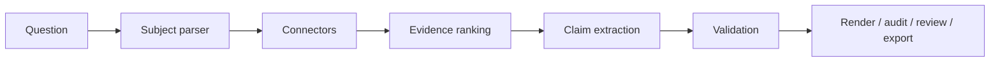

<div align="center">

<pre>
 ######################################################################################################

 __     __        _  __ _          _   ____       _                          _                    _   
 \ \   / /__ _ __(_)/ _(_) ___  __| | / ___|  ___(_) ___ _ __   ___ ___     / \   __ _  ___ _ __ | |_ 
  \ \ / / _ \ '__| | |_| |/ _ \/ _` | \___ \ / __| |/ _ \ '_ \ / __/ _ \   / _ \ / _` |/ _ \ '_ \| __|
   \ V /  __/ |  | |  _| |  __/ (_| |  ___) | (__| |  __/ | | | (_|  __/  / ___ \ (_| |  __/ | | | |_ 
    \_/ \___|_|  |_|_| |_|\___|\__,_| |____/ \___|_|\___|_| |_|\___\___| /_/   \_\__, |\___|_| |_|\__|
                                                                                 |___/                

 ######################################################################################################
</pre>

**Evidence-backed scientific AI report infrastructure**

Treat every AI-generated scientific report like a software build artifact —  
inputs, source records, claims, validation, provenance, and review status.

<br>

[](https://github.com/fraware/verified-science-agent/actions/workflows/ci.yml)


<br>

[Documentation](docs/README.md) · [API](docs/api.md) · [Benchmark](docs/benchmark.md) · [Changelog](CHANGELOG.md)

</div>

---

## Overview

Verified Science Agent (VSA) turns scientific questions into inspectable `ScientificReport` JSON artifacts. Retrieval produces evidence. Generation produces claims. Validation checks claims against evidence. Models cannot invent source fields.

**Mission:** Scientific AI reports should be inspectable by engineers, readable by scientists, and shareable with reviewers — with signed or hashable outputs.



**Core rule:** retrieval → evidence · generation → claims · validation → proof

---

## Quick start

```bash
git clone https://github.com/fraware/verified-science-agent.git
cd verified-science-agent
pip install -e ".[dev,ui,pdf,signing,api]"
make demo && pytest && vsa benchmark
```

Or run the full suite in one step:

```bash
make acceptance
```

`make acceptance` runs a demo build, all tests, and the 50-task evaluation suite.

<details>
<summary><strong>Typical workflow</strong></summary>

```bash
# Retrieve and build
vsa retrieve "BRCA1 c.68_69del"
vsa build examples/brca1_input.json --out reports/brca1_report.json --claim-mode rule

# Validate, audit, export
vsa validate reports/brca1_report.json
vsa audit reports/brca1_report.json --audit-mode rule --out reports/audit.json
vsa export reports/brca1_report.json --out-dir reports/bundle --audit-mode rule
vsa verify-bundle reports/bundle

# Attestation and review
vsa attest reports/brca1_report.json --out reports/attestation.json --subject-name report.json
vsa review start reports/brca1_report.json --reviewer you@example.com
vsa review approve-claim reports/brca1_report.json --reviewer you@example.com --claim C002
vsa verify-review reports/brca1_report.json

# Render, sign, serve
vsa render reports/brca1_report.json --format markdown --out reports/brca1_report.md
vsa sign reports/brca1_report.json
vsa serve --port 8000
```

</details>

```bash
make demo                      # build + validate + audit + export + verify-bundle
streamlit run ui/app.py        # interactive inspector with credibility warnings
```

---

## Features

| Area | What you get |
|------|----------------|
| **Artifacts** | Canonical `ScientificReport` schema (v1.2.0), provenance hashes, export bundles |
| **Credibility** | ClinVar ambiguity alerts, metadata-only warnings, AlphaFold predicted-structure labeling |
| **Verification** | Schema + semantic validation, rule/hybrid audit, SLSA/in-toto attestation |
| **Review** | Human review workflow with verifiable event chains |
| **Benchmark** | 50-task evaluation suite with quality checks |
| **API** | REST server with optional `VSA_API_KEY` auth |

---

## CLI reference

### Build and retrieve

| Command | Description |
|---------|-------------|
| `vsa retrieve "question"` | Retrieve evidence from databases |
| `vsa build input.json --out report.json` | Build a full ScientificReport |
| `vsa extract input.json` | Extract claims (rule or LLM) |
| `vsa benchmark` | Run 50-task benchmark suite (`--live` for network) |

### Validate and audit

| Command | Description |
|---------|-------------|
| `vsa validate report.json` | Schema + semantic validation |
| `vsa audit report.json` | Scientific audit (rule + optional LLM hybrid) |
| `vsa compare report_a.json report_b.json` | Diff two reports |
| `vsa compare-audit audit_a.json audit_b.json` | Diff audit artifacts |

### Export and verify

| Command | Description |
|---------|-------------|
| `vsa export report.json --out-dir dir/` | Full bundle: report, audit, provenance, sources/, manifest |
| `vsa verify-bundle dir/` | Verify manifest hashes and attestation |
| `vsa attest report.json --out attestation.json` | SLSA/in-toto provenance attestation |
| `vsa verify-attestation report.json attestation.json` | Verify attestation digest |

### Review

| Command | Description |
|---------|-------------|
| `vsa review start report.json --reviewer NAME` | Start human review session |
| `vsa review approve-claim ... --claim C001` | Approve specific claims |
| `vsa review verify report.json` | Verify review chain hashes |
| `vsa verify-review report.json` | Alias for `review verify` |

Legacy flags remain supported: `vsa review report.json --reviewer NAME --approve C001`.

### Render, sign, and serve

| Command | Description |
|---------|-------------|
| `vsa render report.json --format markdown\|html\|json\|pdf` | Render report |
| `vsa hash report.json` | Provenance hash chain |
| `vsa sign report.json` | Ed25519-sign report provenance hash |
| `vsa verify-signature report.json` | Verify Ed25519 signature |
| `vsa serve --port 8000` | Start REST API (requires `[api]` extra) |

REST endpoint parity: [docs/api.md](docs/api.md)

---

## Scientific credibility

VSA enforces policies that make weak evidence hard to miss:

- **ClinVar ambiguity** — ambiguous queries capped to low reliability; `CLINVAR AMBIGUITY ALERT` in report warnings
- **Metadata-only papers** — `SCIENTIFIC CREDIBILITY WARNING` when all publication evidence is bibliographic only
- **AlphaFold** — summaries always declare predicted structure; never treated as experimental
- **Materials Project** — missing API key degrades with an explicit skip warning

Warnings surface in CLI output, markdown/HTML render, validation checks, and the Streamlit UI.

---

## LLM modes (optional)

Copy `.env.example` to `.env` and add API keys. Never commit `.env`.

```bash
vsa build examples/brca1_input.json --out reports/brca1_report.json --claim-mode auto
vsa audit reports/brca1_report.json --audit-mode auto
```

Rule-based modes require no API keys and are used in CI:

```bash
vsa build examples/brca1_input.json --out reports/brca1_report.json --claim-mode rule
vsa audit reports/brca1_report.json --audit-mode rule
```

The LLM auditor evaluates only claim text and cited evidence in the payload — it cannot introduce new sources.

---

## ScientificReport schema

Canonical artifact model (schema **1.2.0**, also accepts **1.0.0** and **1.1.0**):

```
ScientificReport
├── subject
├── claims[]
├── evidence[]
├── methods[]
├── provenance
├── validation_results
├── human_review
└── generated_outputs
```

Schema: `src/vsa/schemas/scientific_report.schema.json` · Field reference: [docs/schema.md](docs/schema.md)

**Domains:** genomics variants, proteins, papers, chemicals, materials, experiments.

---

## Connectors

Read-only connectors with normalized evidence and file caching (`.vsa_cache/`):

| Category | Sources |
|----------|---------|
| Literature | OpenAlex, Crossref, PubMed, Europe PMC, Semantic Scholar |
| Genomics / protein | ClinVar, UniProt, AlphaFold DB |
| Materials | Materials Project (`MATERIALS_PROJECT_API_KEY`) |

Details: [docs/connectors.md](docs/connectors.md)

---

## Benchmark

50 evaluation tasks covering genomics, proteins, papers, materials, and edge cases:

```bash
vsa benchmark
```

Measures source recall/precision, citation integrity, evidence validity, review boundaries, contradiction detection, and bundle reproducibility. See [docs/benchmark.md](docs/benchmark.md).

---

## Repository layout

```
verified-science-agent/
├── src/vsa/            CLI, pipeline, connectors, validation, API
├── schemas/            JSON Schema (symlink to package schema)
├── benchmarks/         50 tasks + offline fixtures
├── examples/           Input files and good/bad report examples
├── docs/               Architecture, schema, connectors, API
├── ui/                 Streamlit inspector
├── scripts/            Full test suite helper
└── .github/workflows/  CI and release pipelines
```

Architecture: [docs/architecture.md](docs/architecture.md)

---

## Development

```bash
pip install -e ".[dev,signing,api]"
pytest
make demo
```

---

## Safety notice

Research infrastructure only. Not a medical device, clinical decision system, or diagnostic platform.

> Research infrastructure output. Not for diagnosis, treatment, or clinical decision-making without qualified expert review.

Human expert review is required before any clinical use.

---

## License

MIT License — see [LICENSE](LICENSE).
